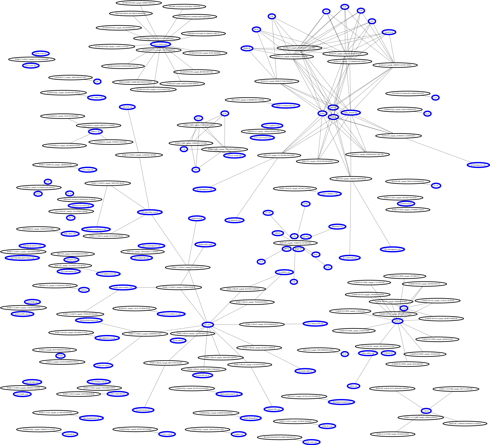

# Network graph


This code is inspired in the [Malware Data Science](https://nostarch.com/malwaredatascience) book, and uses an [Bipartite Graph](https://en.wikipedia.org/wiki/Bipartite_graph) to build two sets, Domains and Samples, and the connect each one.


## Bipartite Graph


Bipartite graph is a graph where the vertices(nodes) can be splited in two groups and be connected to each other, that way, each vertice can have multiple connections to an specific set and can be used to determine how many nodes in a give group has an relation in another group.

In this code, i extracted all samples strings of a given path, and apply a regex rule to extract possible domain names + load a valid [domain suffixes](domain_suffixes.txt) to create an valid dictionary to extract only valid domains from the samples.


With that is possible to create an set of domains and a set of samples, and then connect each sample to a given domain and find which samples shares the same domain, thus, find and classify possible malware campaigns or a set of malware controlled by the same C2/group.


## Domain graph of [APT1](https://www.fireeye.com/content/dam/fireeye-www/services/pdfs/mandiant-apt1-report.pdf)




## Running

```
$ pip install -r requirements.txt
$ python mal_vis.py --target_path <path_to_samples>
```

This will generate a [DOT](https://www.graphviz.org/doc/info/lang.html) file that you can further import in any [graphviz](https://www.graphviz.org/) tool.


Again, all thanks to [Malware Data Science](https://nostarch.com/malwaredatascience).

